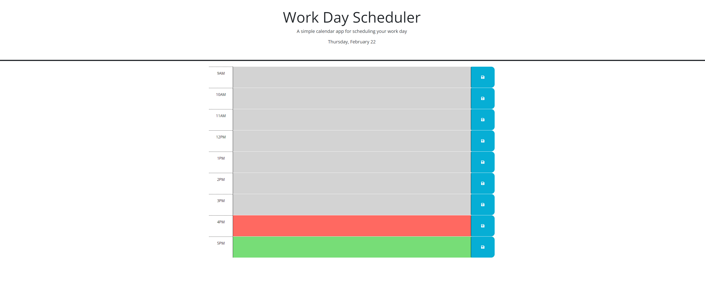

# Work-Day-Scheduler

Editable Work day scheduler that changes based on time of day.
https://rothgq.github.io/Work-Day-Scheduler/

## Navigation
- [User-Story](#user-story)
- [Description](#description)
- [Author](#author)

## User-Story

AS AN employee with a busy schedule
I WANT to add important events to a daily planner
SO THAT I can manage my time effectively

## Description

This application is designed to store notes in local storage as a daily planner. At the start of the workday, all hours but the current one appear green, while a current work hour appears red, and past work hours become gray.

To add a note, select the box of the corresponding hour and input your text. Finally, hit the save icon at the end of the row. Upon reopening the page, your notes will remain. To replace a note, simply reselect the hour's text box, update the note, and save again.

## Author

Gregory Quinn Roth - https://github.com/rothgq